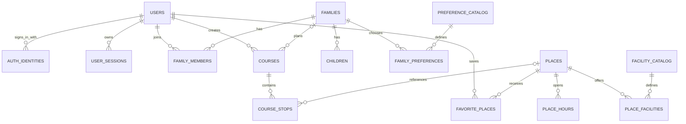

# ERD

```mermaid
erDiagram
  USERS ||--o{ AUTH_IDENTITIES : signs_in_with
  USERS ||--o{ USER_SESSIONS : owns
  USERS ||--o{ FAMILY_MEMBERS : joins
  USERS ||--o{ COURSES : creates
  USERS ||--o{ FAVORITE_PLACES : saves
  FAMILIES ||--o{ FAMILY_MEMBERS : has
  FAMILIES ||--o{ CHILDREN : has
  FAMILIES ||--o{ FAMILY_PREFERENCES : chooses
  PREFERENCE_CATALOG ||--o{ FAMILY_PREFERENCES : defines
  FAMILIES o|--o{ COURSES : plans
  COURSES ||--o{ COURSE_STOPS : contains
  PLACES o|--o{ COURSE_STOPS : references
  PLACES ||--o{ PLACE_HOURS : opens
  PLACES ||--o{ PLACE_FACILITIES : offers
  FACILITY_CATALOG ||--o{ PLACE_FACILITIES : defines
  PLACES ||--o{ FAVORITE_PLACES : receives
```
